# IO-网络编程-基础概念

* 网络编程的本质是进程间通信
* 通信的基础是IO模型

## 一、java.io 

### 1、总览
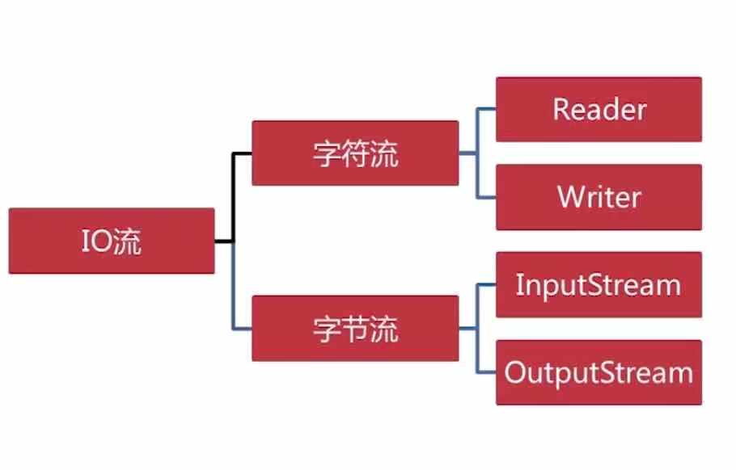

### 2、java.io里面的字符流
#### 1>、基本的字符流：在创建CharArrayReader或者StringReader的时候，需要在构造器中传入具体的数据源。writer一样
    从构造器中传入的数据源中读取数据，或者往这个数据源中写入数据
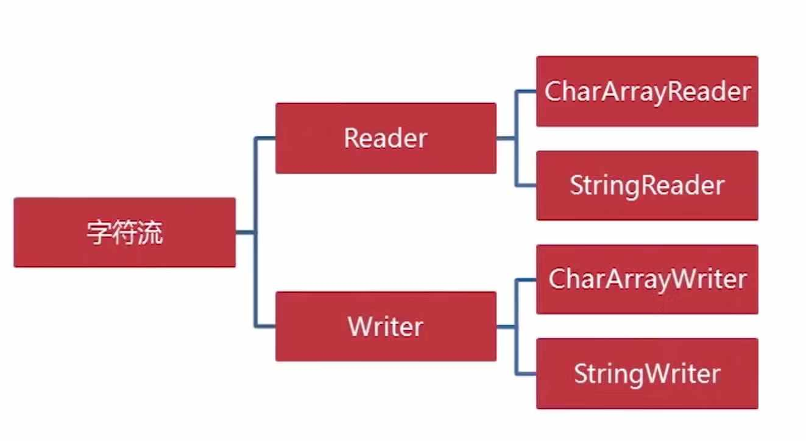

    
#### 2>、相对更高级的字符流：BufferedReader、FilterReader、InputStreamReader等这些reader在创建他们的时候，都需要再额外的传入一些Reader才可以
    也就是这三个Reader类，他们都不是独立生存的，而是叠加在另外一个Reader之上，和他们一起作用的
    也就是在基本的Reader和Writer之上在提供一些额外的功能
* BufferedReader：给Reader增加一个缓冲区，这样就可以一次性从数据源中多读取一些数据，先放到缓冲区中，然后应用进程可以频繁的从缓冲区进行读写
* FilterReader：(是一个抽象类，有很多扩展的子类)可以对Reader读进来的字符流做一些额外的操作，比如可以跳过字符流中一些特定的字符而不去处理它，或者对某个字符标记，重复读取
* InputStreamReader：它是把字节流转换成一个字符流的类， 常用子类为FileReader(将以字节存储的文件转换为字符流读入)
 
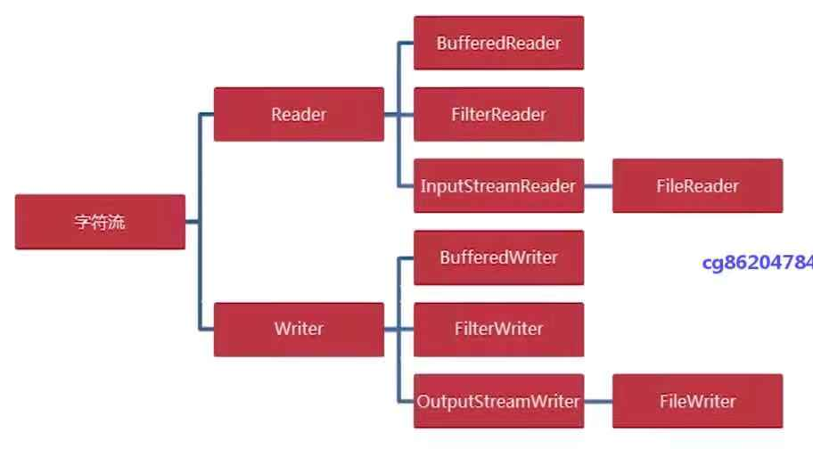   

### 3、java.io里面的字节流
#### 1>、基本的字节流：ByteArrayInputStream、FileInputStream
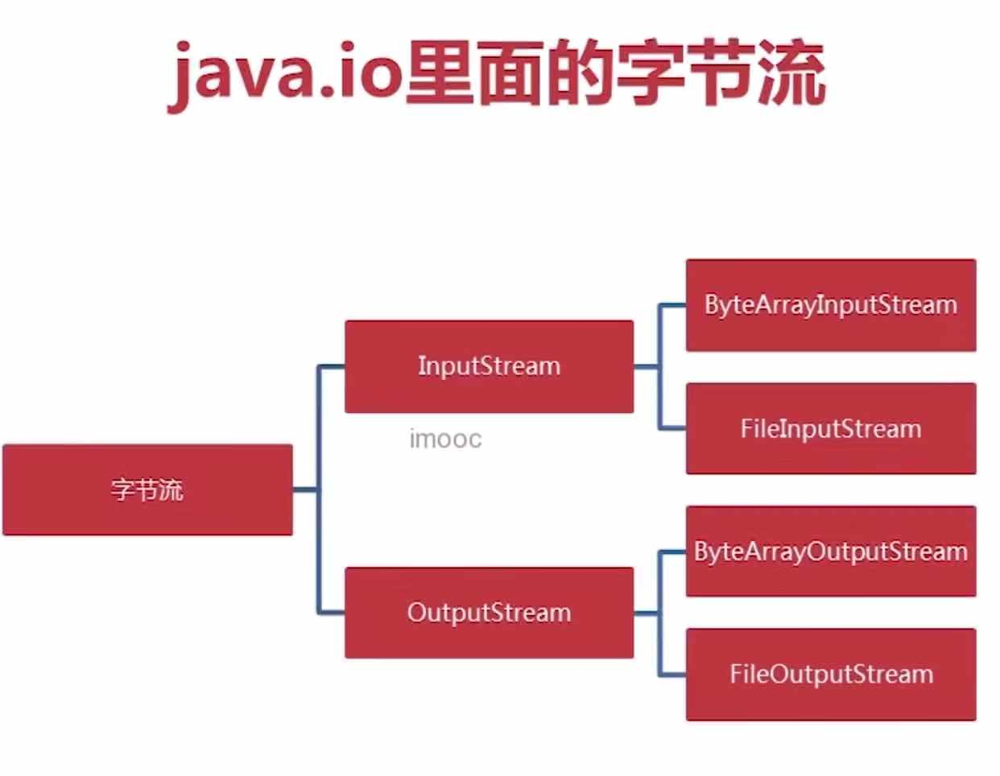

#### 2>、高级的字节流：(FilterInputStream) BufferedInputStream、DataInputStream 需要在创建的时候添加一个字节流对象，
    为添加的字节流对象增加一些功能
* BufferedInputStream：增加缓冲区，效率更高  
* DataInputStream：和DataOutputStream结合使用，可以对基本数据类型进行读写操作(将字节流读或者写成基本数据类型)

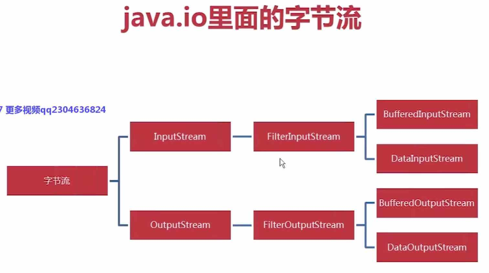

### 4、java.io里面的装饰者模式
* java.io中大部分高级的类，在创建的时候都依赖基础的类，为基础的类增加一些其他功能，这种设计模式就是装饰者模式(decorator pattern)

    
    BufferedInputStream所做的就是额外提供一个缓冲区，来进行更高效率的读写

## 二、Socket也是一种资源
### 1、Socket是网络通信的端点
    
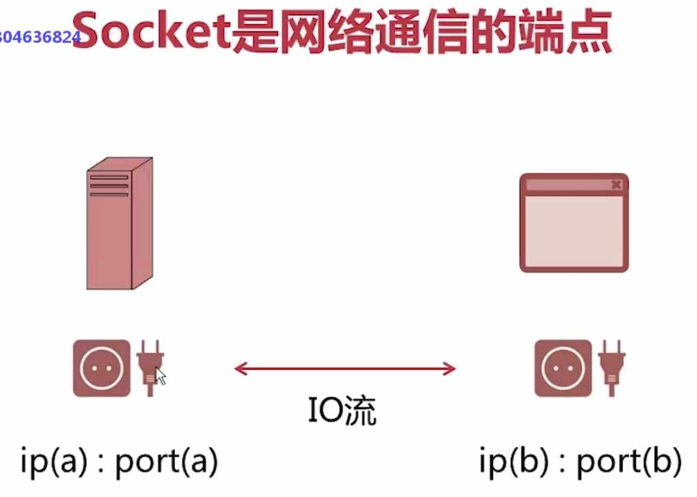
    
    Socket是服务器进程这一端如果他要和其他服务器或者和其他的网络进程进行任何网络通信的端点

### 2、Unix中的Socket是什么？
* Unix系统中一切皆是文件
* 文件描述符表示已打开文件的索引
* 每个进程都会维护一个文件描述符表

### 3、通过socket发送数据

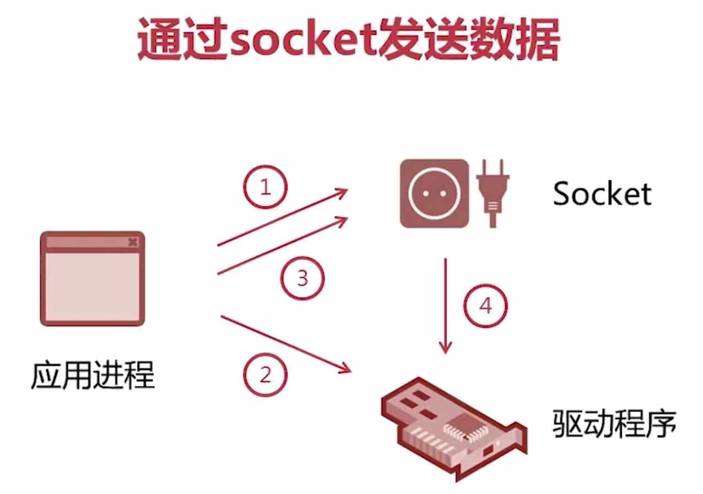

#### （1）、创建Socket
    首先应用进程会创建一个Socket(这个socket就是抽象层面的一个网络通信的端点)
#### （2）、将应用进程、IP地址和端口号与驱动程序进行绑定
    接下来就需要告诉网卡驱动程序，所有和这个IP还有端口号相关的数据的输入和输出绑定到第一步新建的Socket上
#### （3）、应用程序发送数据到Socket
    接下来如果应用进程需要向网络发送任何的数据，那么它就可以首先把数据发送到这个Socket
#### （4）、网卡真实的发送数据
    最后网卡的驱动程序从Socket里边收到的所有的数据，它首先知道这些数据是由哪一个进程发送的，
    并且知道这些数据要发送到网络中的哪个IP和端口，然后它就可以真的将这些数据从硬件层面由网卡发送到它想要发送到的目的地

### 4、通过socket接收数据

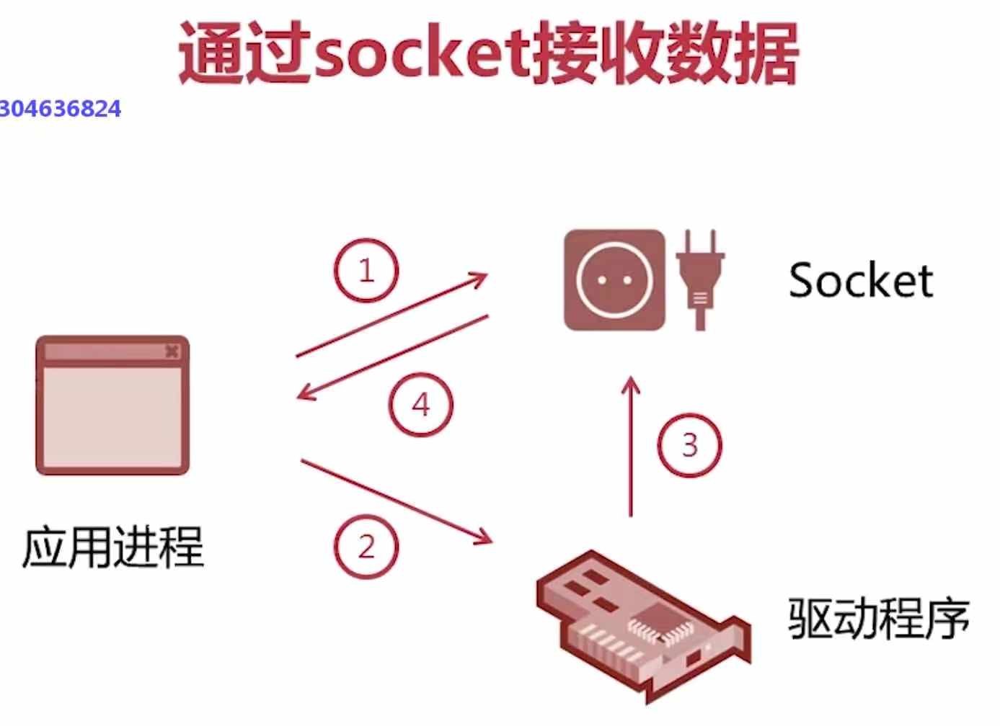

#### （1）、创建Socket
    首先应用进程会创建一个Socket(这个socket就是抽象层面的一个网络通信的端点)
#### （2）、将应用进程、IP地址和端口号与驱动程序进行绑定
    接下来就需要告诉网卡驱动程序，所有和这个IP还有端口号相关的数据的输入和输出绑定到第一步新建的Socket上
#### （3）、网卡从网络中收集数据并识别
    接下来网卡从网络中收集到的数据，一旦他识别到任意一段由网络当中传送来的数据是想要传送给应用进程对应的IP地址加端口的时候，
    那么驱动程序就会把这一部分程序传输到接收这个数据的网络通信的端点了(Socket)
#### （4）、应用进程从对应的Socket上边读取对应的数据
    最后对应的应用进程从对应的Socket上边读取对应的数据

## 三、同步/异步/阻塞/非阻塞

* 1、同步 vs 异步     (侧重被调用方的行为) ：通信机制俩种不同的区别
* 2、阻塞 vs 非阻塞   (侧重调用方的状态)   ：等待调用结果返回之前调用方处于什么状态

### 1、一个直击灵魂深处的例子

* 场景：男孩向女孩表白

#### （1）、同步通信机制

    女孩陷入沉思，好好的考虑是否要接受男孩的表白，此时男孩只能坐在女孩对面默默的等待，直到女孩想好了
* 此时就类似我们的同步通信机制，发出表白的男孩子就好比发出请求的一方，或者是发出调用的一方，
    收到请求的一方(女孩子这边)，她要花上一定时间直到它处理结束

#### （2）、异步通信机制 

##### 当我们不需要等待调用或请求的返回结果，就已经可以直接返回或者调用完成
    女孩子可能会让男孩子给她几天时间让她考虑一下，等她考虑好了，再给男孩子发个消息，
* 女孩子说完这些话，那么这次表白(调用或请求)就已经结束了，此时调用已经返回了，
    但是男孩子(请求方或者调用方)还不知道这次调用或者请求的结果，必须等待女孩子给他发消息以后，他才能知道结果

#### （3）、阻塞式调用

    当男孩子和女孩子表白之后，不管女孩子什么反应(陷入沉思、给女孩子几天时间想想), 
    如果此时男孩子什么事情都干不了了，茶不思饭不想，
* 这种情况就类似于我们的阻塞式调用，发出请求的这一方等待调用或请求的结果收到之前，什么任务都不能处理了，
    只能专心的等待调用的结果    
    
#### （4）、非阻塞式调用

    当男孩子和女孩子表白之后，不管女孩子什么反应(陷入沉思、给女孩子几天时间想想),
    此时男孩子心思比较活跃，还可以玩游戏、打打球
* 这种请求就类似于我们的非阻塞式调用，请求方发出请求之后，照常可以处理其他任务，

### 2、四个调用和通信结果不同场景

#### （1）、同步阻塞

* 男孩向女孩表白，女孩陷入沉思，男孩此时茶不思饭不想就等着女孩答复

#### （2）、同步非阻塞

* 男孩向女孩表白，女孩陷入沉思，男孩此时一会想着刚才玩的游戏，一会想着什么时候去打篮球

#### （3）、异步阻塞

* 男孩向女孩表白，女孩让男孩回去等她消息吧，男孩此时茶不思饭不想就等着女孩答复

#### （4）、异步非阻塞

* 男孩向女孩表白，女孩让男孩回去等她消息吧，男孩此时一会想着刚才玩的游戏，一会想着什么时候去打篮球

### 3、排列组合
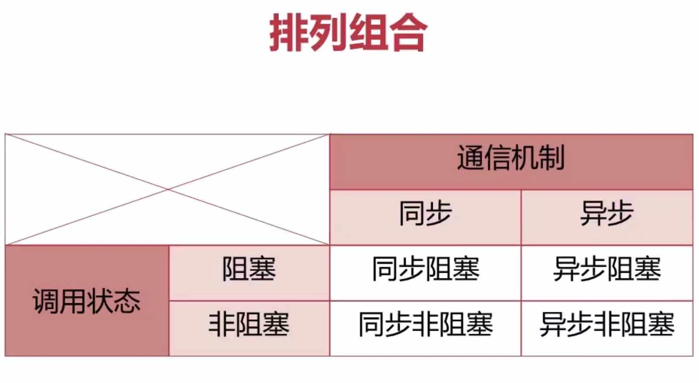

## 四、网络通信中的线程池

* 多个线程并发处理
* 多线程处理中的浪费
* 复用线程

### 1、Java提供的线程池  -- ExecutorService
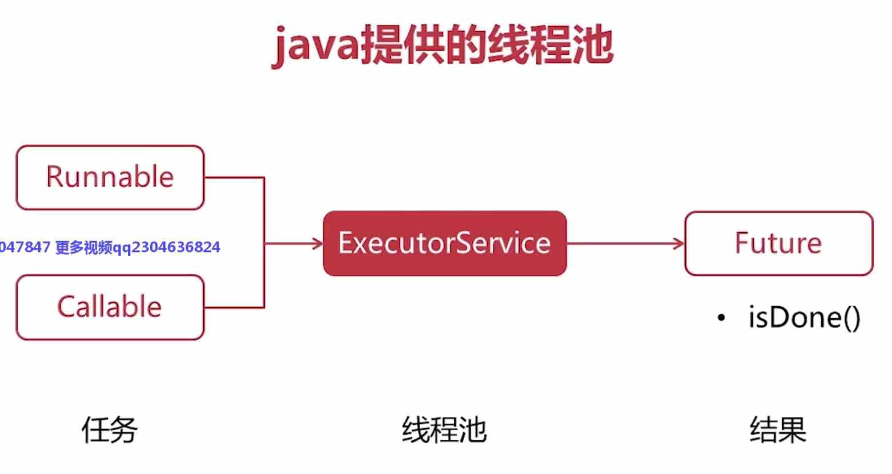

### 2、java提供的创建线程池的的方法 Executors

#### （1）、newSingleThreadExecutor   创建一个单线程的线程池
#### （2）、newFixedThreadPool        可以设定线程池中包含几个线程，一旦设定，线程数是不变的
#### （3）、newCachedThreadPool       当提交一个新任务，如果线程池中所有的线程都处于忙碌的状态，那么它会为新任务创建新的线程
#### （4）、newScheduledThreadPool    可以让新任务在特定的时间或者以特定的频率运行

## 五、Socket与ServerSocket
* ServerSocket一般代表服务端的socket
* Socket一般代表客户端的socket

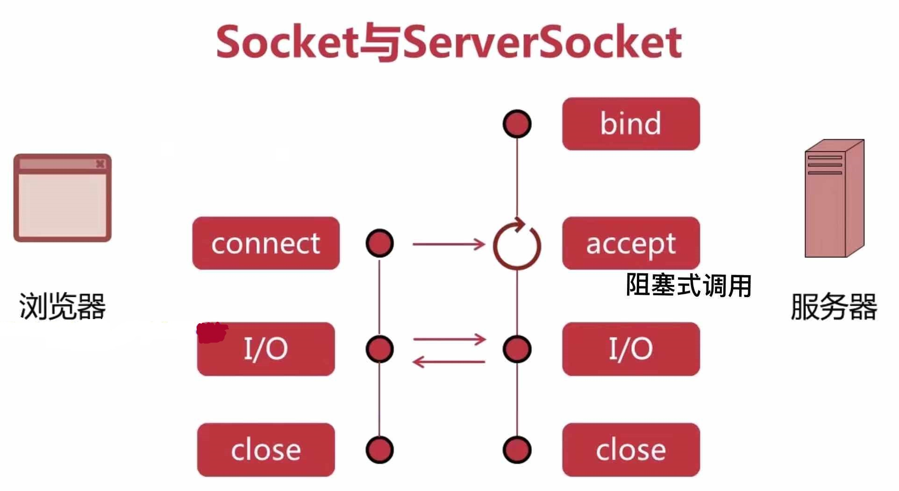

## 六、BIO编程模型(Blocked IO)  -- 阻塞式IO

### 1、传统的BIO编程模型
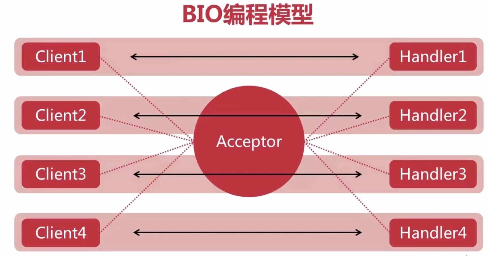

### 2、多人聊天室
* 基于BIO模型（同步阻塞IO模型）
* 支持多人同时在线
* 每个用户的发言都被转发给其他在线用户  

### 3、伪异步IO编程模型

### 4、BIO中的阻塞

#### （1）、ServerSocket.accept()
    这个函数的调用本身是阻塞式的
    在服务器端调用了accept()函数之后就一直等待直到有一个客户单来向我们建立连接，然后服务器端接受了这个服务器请求，accept()这个函数的调用才会返回
#### （2）、InputStream.read(), OutputStream.write()
    所有的输入流和输出流，它的读和写所有的调用都是阻塞式的，
#### （3）、无法在同一个线程里处理多个Stream I/O
    所以在BIO编程模型实现的多人聊天室中使用的多线程，通过伪异步的方式来创建多个线程来处理多个客户端的输入和输出

## 七、非阻塞式NIO (New-IO, non-Blocked-IO)

### 1、使用Channel代替Stream
#### Channel(通道) 和 Stream(流) 的区别:
* Stream：是有方向的--- 输入流和输出流, Stream流的读写的方法都是阻塞式的
* Channel：是双向的，一个Channel既可以写入数据，也可以读取数据， Channel(通道) 的读写有俩种模式的，既可以像传统的流是阻塞式的读写，它也提供了非阻塞式的读写

### 2、使用Selector监控多条Channel
* 使用Selector 保证循环监控Channel通道中数据的变化，并且及时给调用方反馈

### 3、可以在一个线程里处理多个Channel I/O
* 使用NIO是完全有可能在一个线程里处理多个Channel的     

#### 扩展：多线程并不一定是更有效率的，多线程至少有俩点是会增加系统负担的
* 1、如果你要处理的线程的数量多过了你的CPU处理器的数量， 就一定会出现一个现象 Context Switch(上下文切换)，因为每一个CPU它需要不停的执行多个线程，也就是说它必须要在多个线程之前进行切换，而每一次切换都必须保存住当前线程所有的状态，再把它和另外一个我们要执行的线程进行交换，等到我们又要执行之前存储的那条线程，我们又得把之前存储的线程的状态加载回来，在各个线程之间发生的交换的过程，本身就是会占用系统资源的，会浪费时间的
* 2、没创建一个线程，系统需要为这个线程分配一部分系统资源的，比如说内存，当你创建多个内存，每个线程需要分配和占多一部分系统资源，即使这部分资源没有被利用，操作系统也需要为它分配这一部分资源，当线程数量越来越多的时候，系统资源的浪费也会成为一个负担，所以多线程也并不是绝对的性能高.

### 4、Channel(通道) 与 Buffer(缓冲区)
* NIO中的Channel替代了BIO中的Stream，是双向的，既可以读，也可以写，
* Channel无论是读还是写，其实都是通过Buffer类来完成的

#### （1）、向Buffer写入数据

    position 目前操作所在的位置
    capacity 整个Buffer缓冲区最大的容量，指向最多可以写到的位置
    limit 在向Buffer中写入数据的时候， limit指针指向capacity所指向的位置

#### （2）、flip()方法   反转方法 ：从写模式转换成读模式, 转换成从Buffer中读
    
    把position指针放回到Buffer的起始点
    此时limit指针指向所能读到的最远的位置 

#### （3）、从Buffer读取数据
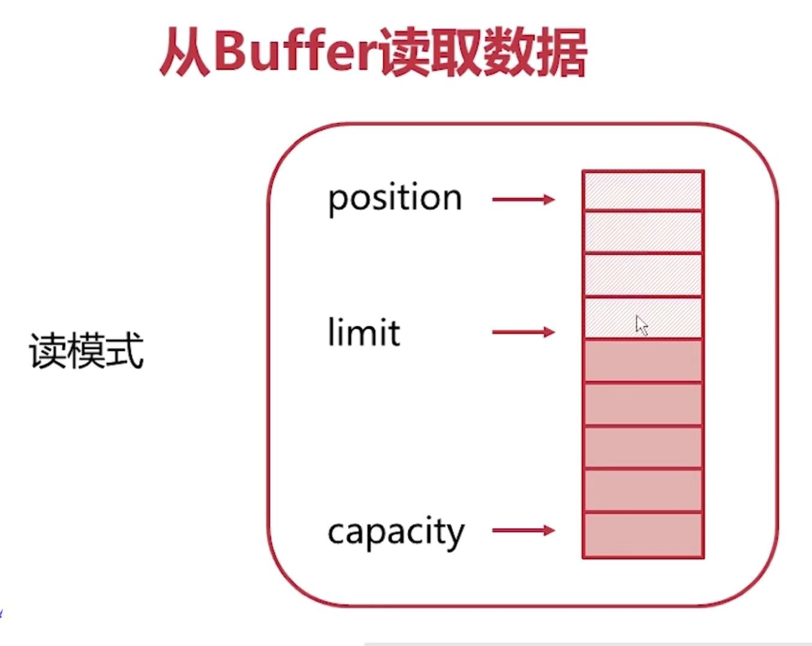

#### （4）、clear()方法 
* 不包含未读取数据   
* 反转方法 ：从读模式转换成写模式
  
  
    clear()方法会把position指针移动到初始位置
    limit指针从原本指向所能读到的最远的位置更改为与capacity一样，指向缓冲区的最大位置
    
##### 虽然这个方法叫做clear，但是并没有将之前写入的数据进行任何实质性的清除，但是在写模式的情况下写入的起始位置发生了变化，所以起到了和请求一样的目的，同时效率更高
    
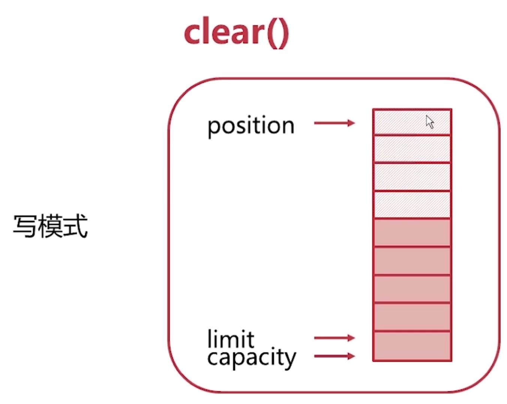

#### （4）、compact()方法  
* 包含未读取数据 
* 反转方法 ：从读模式转换成写模式
* 把未读取的数据拷贝到整个Buffer最开始的位置
  
  
    position指针移动到未读数据处
    limit指针从原本指向所能读到的最远的位置更改为与capacity一样，指向缓冲区的最大位置  
    
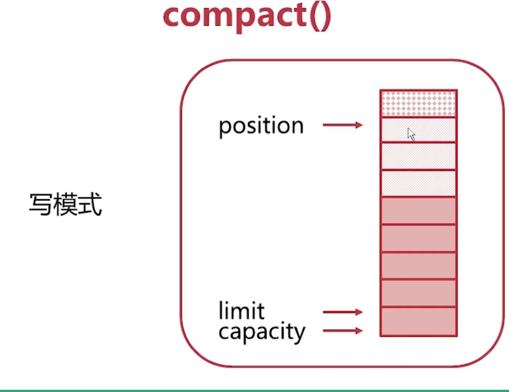

### 5、Channel基本操作
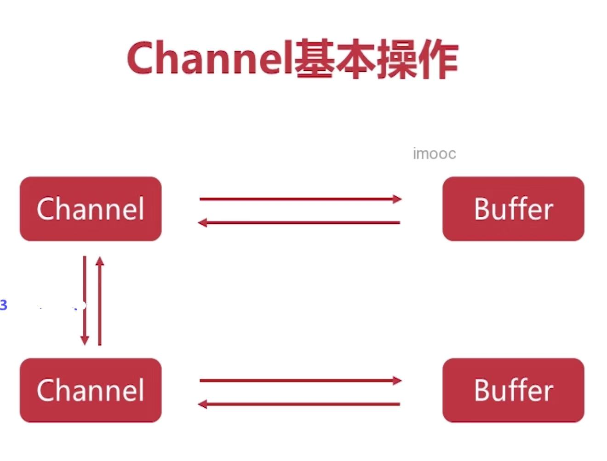

    Channel之间可以进行数据的传输，而不依赖Buffer
    
### 6、几个重要的Channel
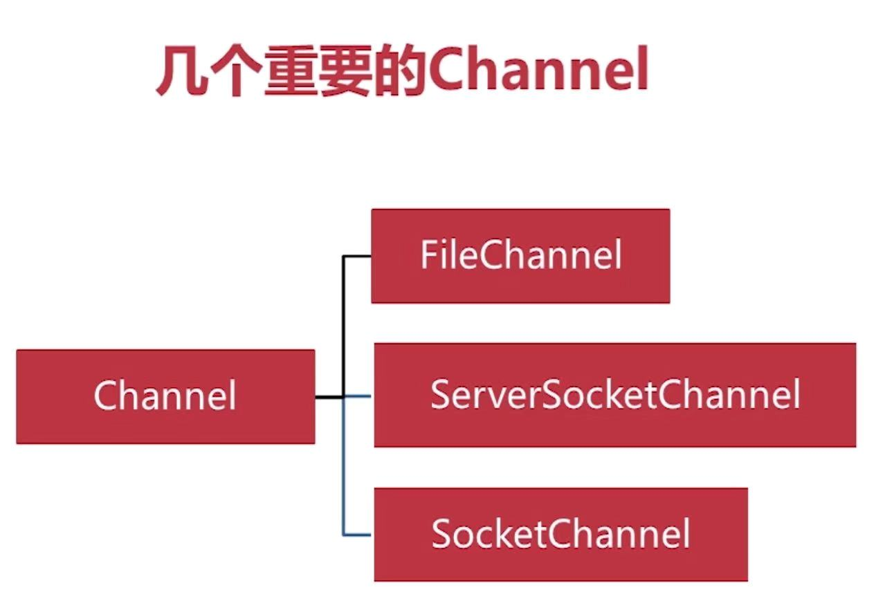

* 1、通过Channel(通道)来进行本地文件的拷贝
* 2、使用传统的BIO来实现本地文件的拷贝

### 7、Selector 和 Channel
* Selector可以帮助我们监听多个通道(Channel)的状态，方便我们确定通道是否处于可操作状态

    我们可以使用通道来进行非阻塞的读写，这就意味着我们需要不停的询问这个通道，是否处在一个可操作的状态上
    这个事情我们自己做就很繁琐，可以使用java.nio提供的Selector，帮我们来监控多个通道的状态，
   

#### （1）、Channel的状态变化
* 每一个Channel的对象在某一个特定的时间，它都处于或者一个不可操作(没什么操作可以进行的状态)，
或者是一个可操作状态
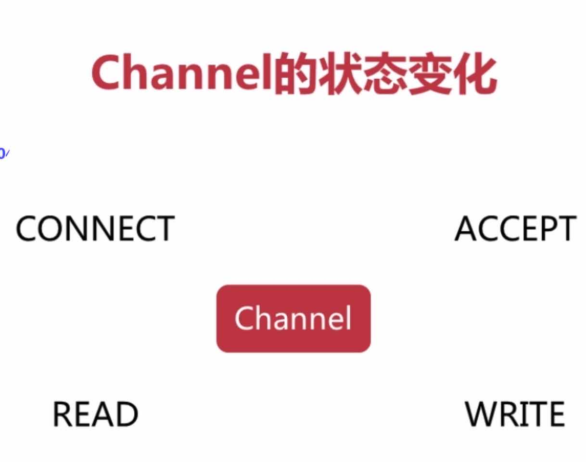

#### （2）、在Selector上注册Channel
* 1、要想让一个Selector真正的监听监控一个Channel，就必须吧这个Chan注册到Selector
* 2、当我们注册完一个Channel对象，得到是一个SelectionKey对象，
    Selector本身就像是一个ID，每一个在Selector上注册的Channel对象，都相当于有了一个对应的独特的SelectionKey作为它的ID，     
* 3、interestOps()可以得到一组Channel注册在Selector上的不同的需要监听的状态，每个Channel可能处在不同的状态，所以在要求Selector监听Channel的时候，
并不是每次都让Selector监听Channel的所有可能的状态，对于一个Channel，我们可能只关心他的某一个状态(比如：可读)，所以将Channel在注册Selector的时候，
可以通过参数来确定在Selector上注册Channel的那些状态，
* 4、readyOps()返回的是对于这个SelectionKey上有哪些被监听的Channel的状态目前是处于可操作的状态，
* 5、channel()直接返回这个SelectionKey所注册的Channel对象
* 6、selector()返回的是在哪个Selector对象上进行注册的
* 7、attachment()对于每一个注册再Selector上的Channel对象，可以在给它加上一个对象(Object，这个对象可以是任何有意义的，对Channel有帮助的对象)

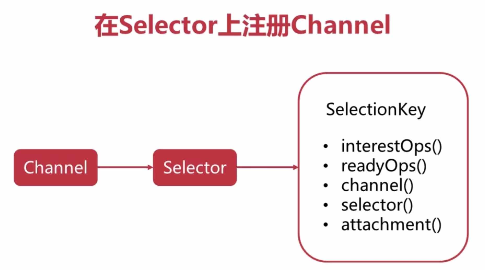
    
        
#### （3）、使用Selector选择Channel
* 如果当前Selector上没有处于可操作的Channel， select() == 0
* 当处理完可操的Channel对象以后，要手动将其状态修改为不可操作状态

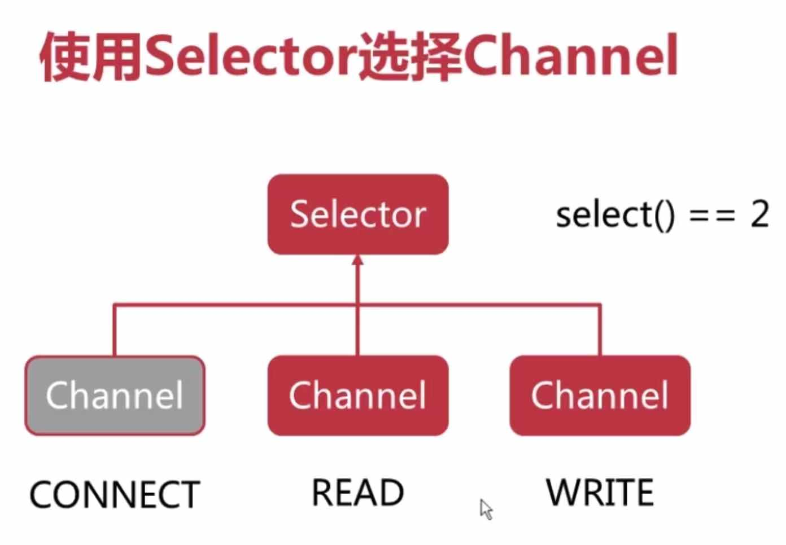

## 八、NIO编程模型
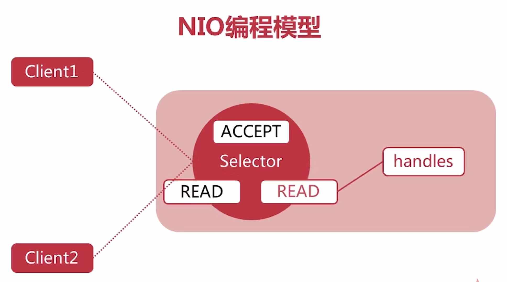

## 九、AIO异步通信模型

### 1、内核IO模型

* 在网络间数据的传输中，在数据的接收端会由网卡接收到数据，然后存放在内核缓存区，然后应用程序从系统内核中读取网络传递过来的数据到应用程序缓冲区
* BIO（阻塞式I/O）、NIO（非阻塞式I/O）、NIO+Selector(I/O多路复用)，这三种都是同步模型，
* 因为在发起系统调用，不管是在发起调用的当时有没有数据在内核缓存区准备好，假如即使没有数据准备好，
    并且很快的返回了系统调用，这个时候应用程序没有被阻塞，但是返回了之后，我们再也不发起系统调用，我们就没有办法收到我们想要的数据，
    之所以说这三种是同步的，是因为如果真的想要得到正在等待的数据，就必须再发起一次新的系统调用，再一次去询问内核是否有数据准备好，这种形式都是同步模型

#### （1）、阻塞式I/O - BIO
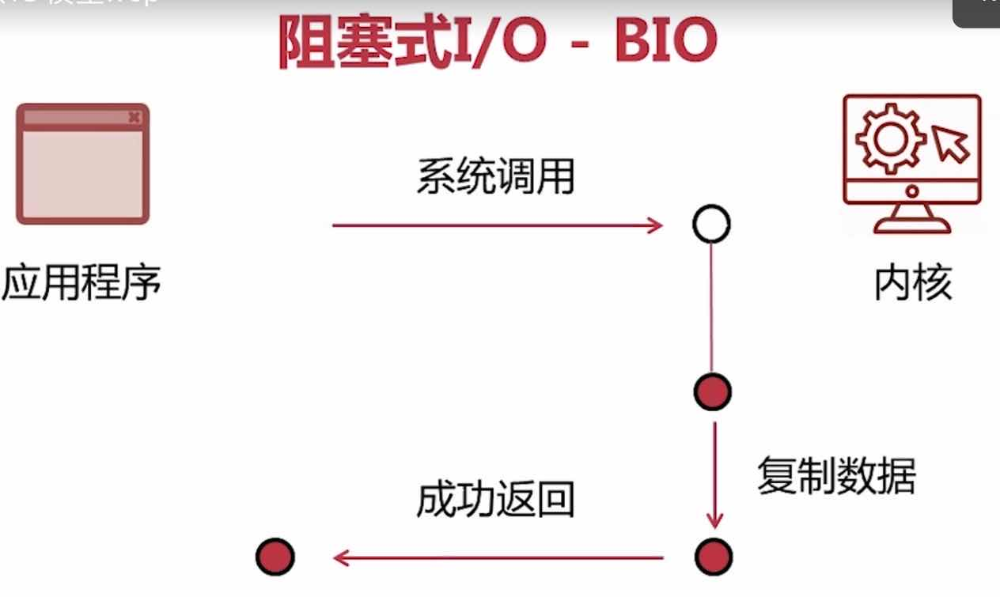

    应用程序一直等待内核返回数据I/O（从网络中收到的数据）

#### （2）、非阻塞式I/O - NIO (这里不包含Selector)
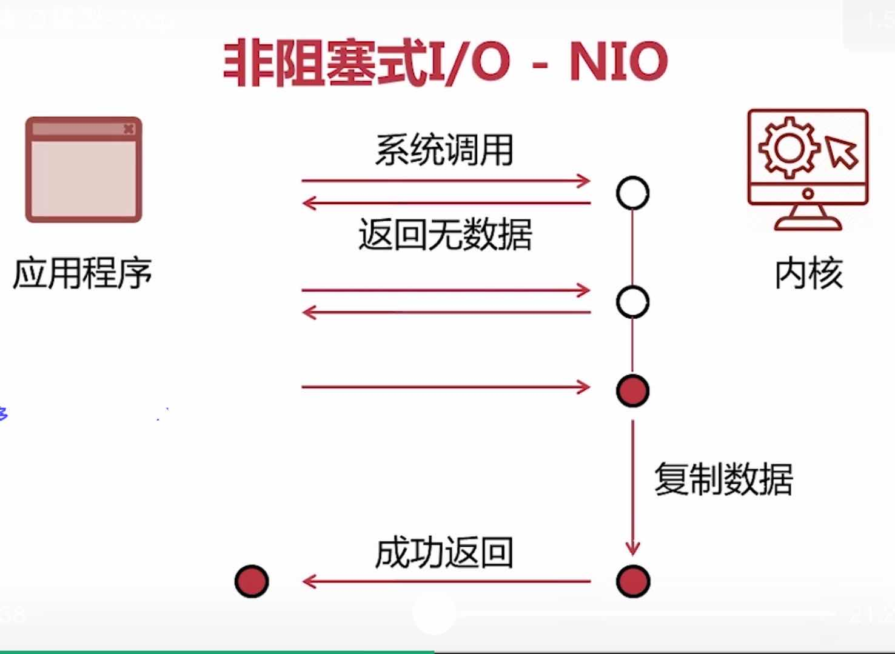

    应用程序持续请求内核，如果此时有数据就返回，没有数据就继续下一次请求
    此时如果想要实时得到内核中的数据，需要通过轮询的方式来请求内核，查看是否有数据
    
#### （3）、I/O多路复用 - NIO + Selector
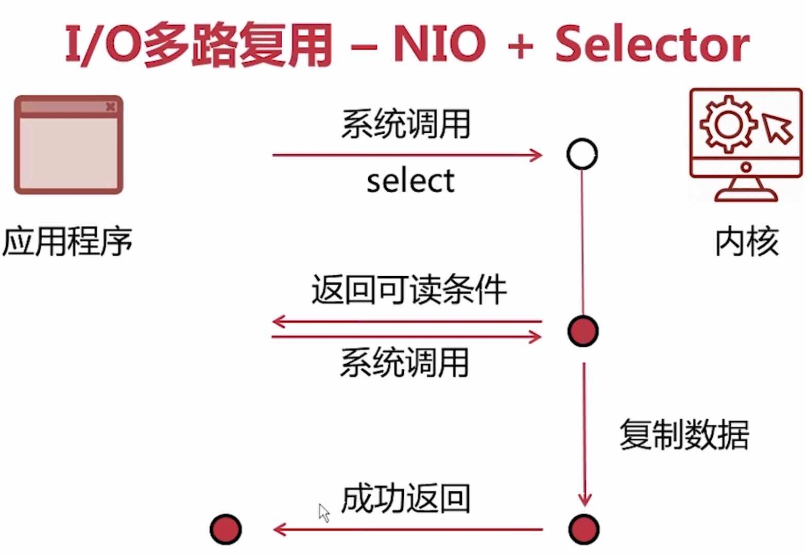
    
    应用程序要求内核去监听要请求的数据I/O通道的状态变化，如果监听I/O通道的状态发生了变化，就给应用程序返回可读条件，应用程序再进行系统调用去内核拷贝数据到应用程序缓冲区
    此时的select方法是阻塞是调用
    
    
#### （4）、异步I/O - AIO  （Asynchronous IO）
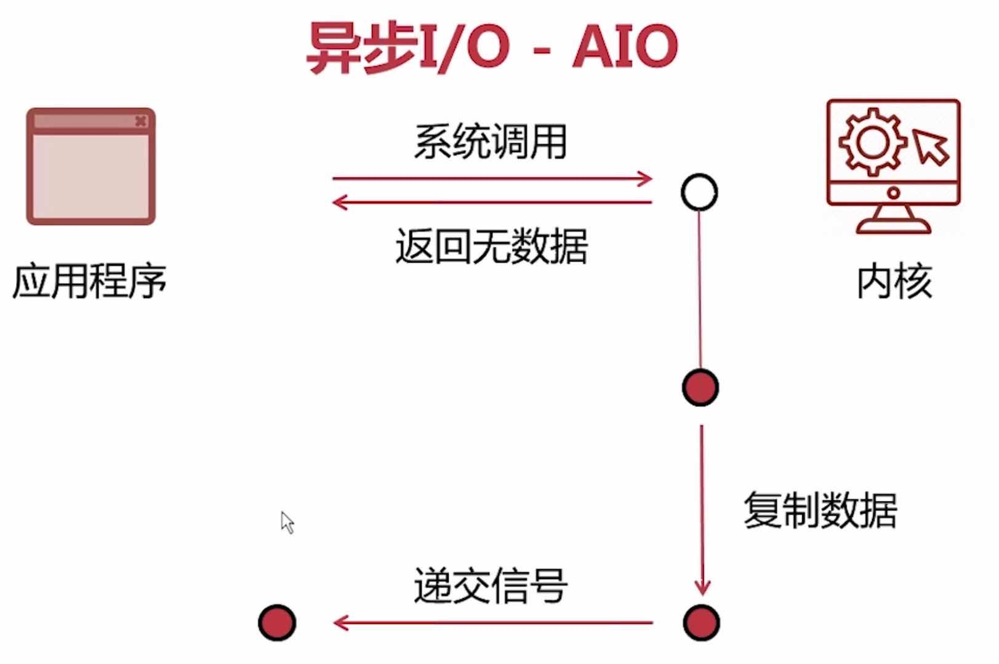

    1、应用程序发起系统调用，询问内核有没有新的数据准备好可以让应用程序进行接下来的处理
    2、如果没有，系统调用直接返回，此时应用程序并不会阻塞在这里
    3、从应用程序层面，不会再发起系统调用了，在内核中，如果当应用程序需要的数据准备好了，并且已经拷贝到内核缓冲区之后，在后台，操作系统会帮我们继续做着IO相关的事情的
        操作系统不到会帮我们注意到什么时候需要的数据已经拷贝到内核的缓冲区了，还会把内核缓存区的数据帮我们复制到应用程序缓冲区，
    4、当这一切事情都完成之后，内核会给我们应用程序递交一个信号，来通知我们应用程序，这种模型就是异步IO模型

### 2、异步调用机制

#### （1）、AIO中的异步操作

* AsynchronousServerSocketChannel  服务端的Socket通道

* AsynchronousSocketChannel       客户端的Socket通道

##### ①、connect / accept
##### ②、read
##### ③、write

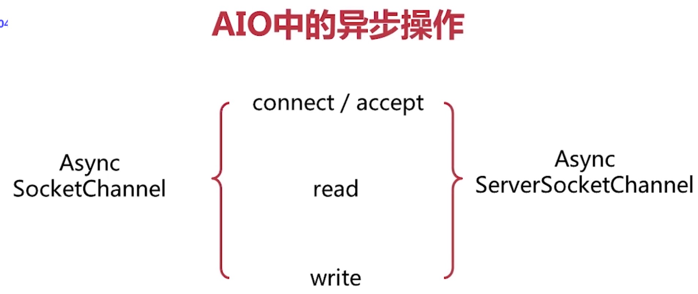

#### （2）、异步调用操作的实现

##### ① 、通过返回Future
    Future就是对未来会完成的一个任务的抽象
    
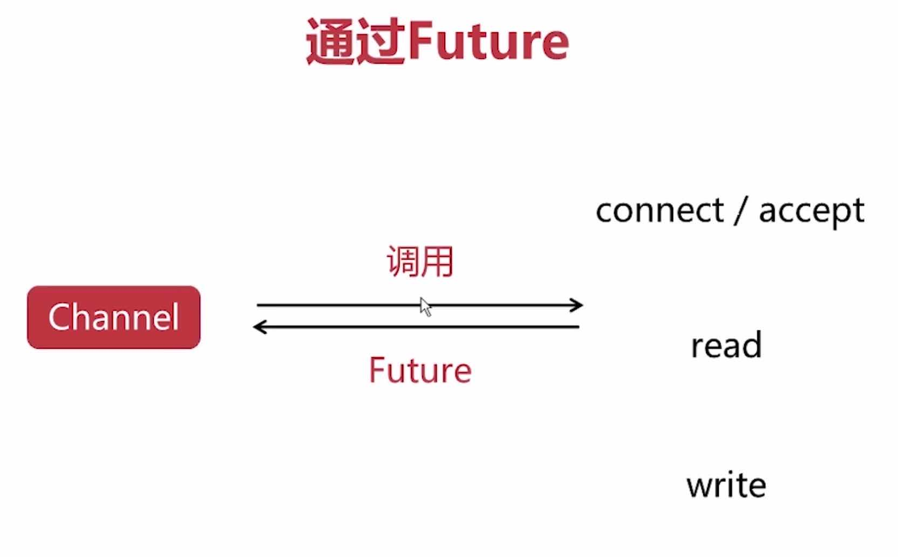

##### ②、通过使用CompletionHandler
    通过回调的方式实现异步
    
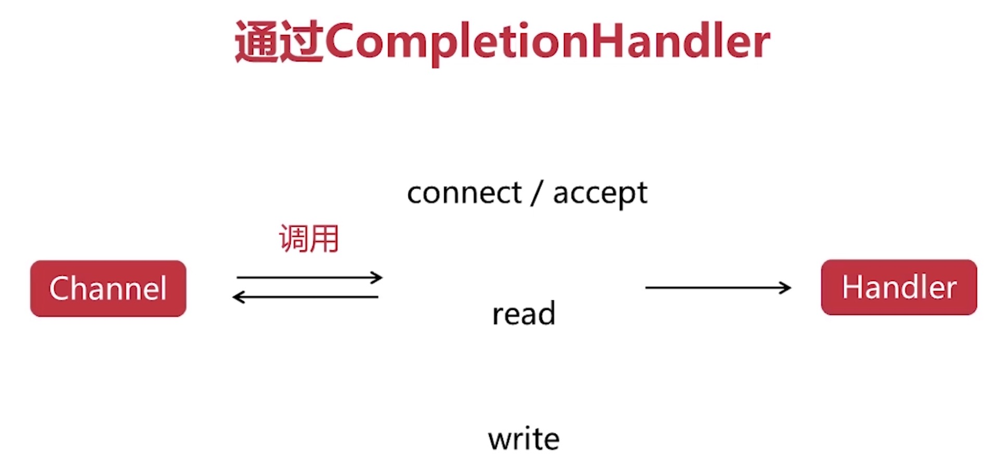

### 3、异步调用实例

### 4、AIO编程模型

#### （1）、AsynchronousServerSocketChannel：
    首先在服务器端创建AsynchronousServerSocketChannel，也就是异步的服务端的通道
* AsynchronousServerSocketChannel实际上是属于AsynchronousChannelGroup，这是一个异步的通道组，
这个通道组或者是通道群指的是一组可以被多个异步通道所共享的资源群组（资源主要包含线程池）,
在AIO编程模型中，操作系统帮我们做了很多事情，当操作系统帮我们准备好了各种数据之后，它会异步的来通知我们数据已经准备好了或者是通过我们之前设置的一些Handler做一个异步的操作
操作系统是怎么样来Dispatc各种各样Handler来操作的？实际上实现是操作系统会用到很多资源，比如线程池，操作系统来通过循环使用这个线程池来处理Handler
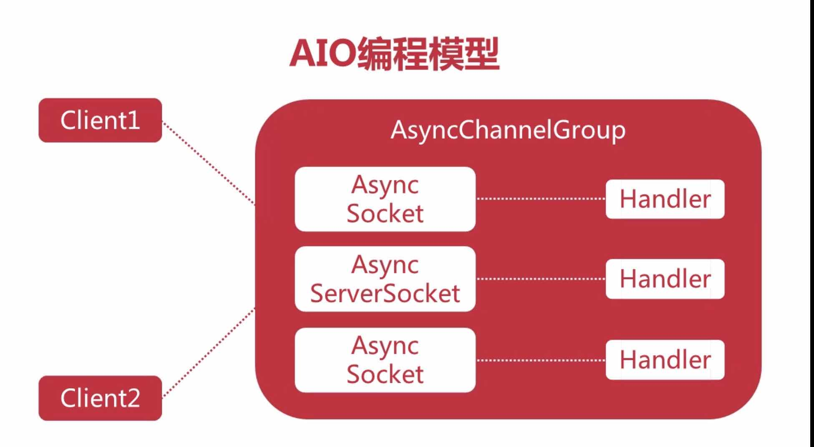

## 十、简易版Web服务器 

### 1、向服务器请求资源

### 2、Tomcat结构
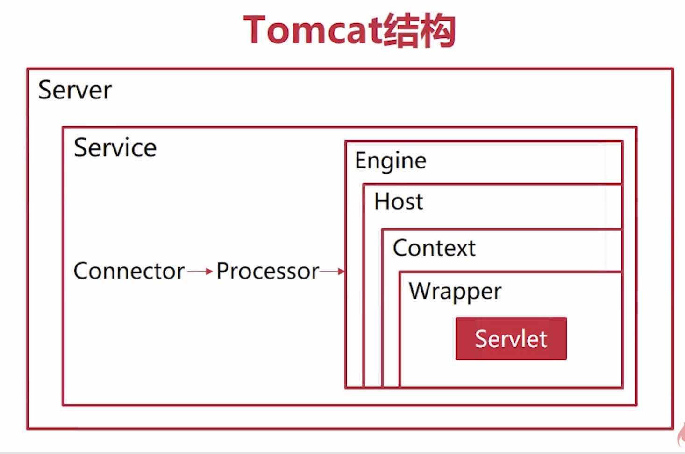

#### （1）Server组件：是整个Tomcat最外层的结构，它是真正运行起来我们的Tomcat服务器的实例
* Tomcat服务器的最顶层组件
* 负责运行Tomcat服务器
* 负责加载服务器资源和环境变量

#### （2）、Service组件
* 集合Connector和Engine的抽象组件

#### （3）、Connector和Processor组件
* Connector提供基于不同特定协议的实现 （HTTP）
* Connector接收解析请求，返回响应
* Connector会把它解析翻译好的请求发送个Processor，经Processor派遣请求至Engine进行处理

#### （4）、Engine
    Engine这部分（一层套一层的结构）在Tomcat的世界里叫做容器，
    在Tomcat中可以理解成一个容器就是一个处理请求的组件
* 容器是Tomcat用来处理请求的组件
* 容器内部的组件按照层级排列
* Engine是容器的顶层组件
* Engine组件主要的任务时看到请求本身的内容，做简单的解析，
最简单的方式就是根据这个请求所包含的IP地址来决定请求应该派遣给哪一个Host组件的

#### （5）、Host组件
* Host组件的作用就是为请求选择合适的Context组件

#### （6）、Context组件  
* Context代表一个Web Application
* Tomcat最复杂的组件之一，担负的责任非常多
* 应用资源管理，应用类加载，Servlet管理，安全管理等、

#### （7）、Wrapper组件
* Wrapper是容器的最底层组件
* 包裹住Servlet实例
* 负责管理Servlet实例的生命周期

## 十、三种I/O模型使用情境
* BIO：连接数目少（同等服务器资源），服务器资源多，开发难度低
* NIO：连接数目多（同等服务器资源），时间短（适合处理任务周期比较短的场景），开发难度较高
* AIO：连接数目多（同等服务器资源），时间长（对任务周期长短没有要求，反正它是异步调用），开发难度较高
