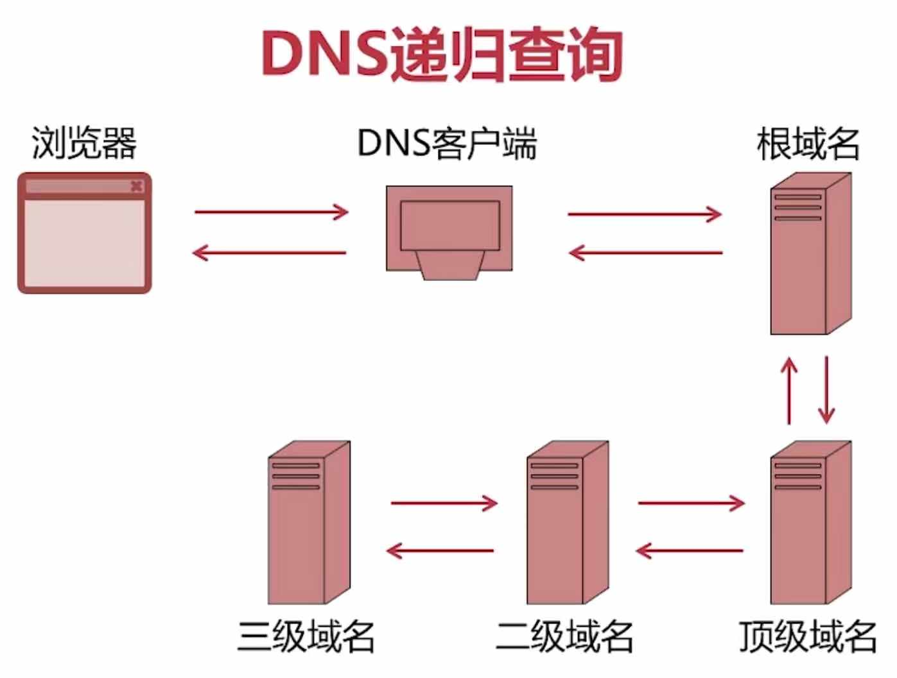
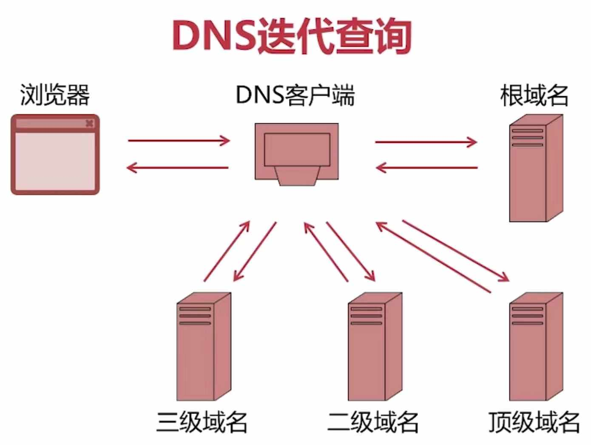
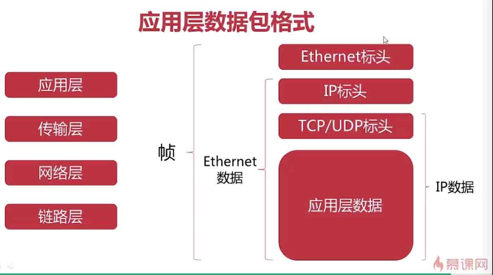

# 网络层的解析与协议

## 一、网络

    http://www.google.com
    
    http://www.google.com:80/search?q=test&safe=strict
    协议    域名/IP地址   端口 路径   参数
    
## 二、DNS解析

    www.google.com      ----> 172.217.161.101
      域名/IP地址
      
    
    www.google.com.root
          
### 1、域名的层级
    
    根域名             .root
    一级域名           .com     .edu    .org 等
    二级域名           .google  .mit等
    主机名             www
    
### 2、DNS递归查询

* Domain Name System， 本质上是一个可以将域名和IP地址相互映射的一个分布式数据库

* 1、用户要求浏览器和网络中的某个主机进行数据的传输，而我们键入的仅仅是一个域名，这个时候浏览器就要把这个域名发送给一个DNS服务器的客户端
* 2、DNS客户端收到了浏览器发送的域名解析请求之后，它就要进入DNS分布式数据库，查找对应的IP地址了，然后首先它把查找请求发送给根域名服务器，
* 3、根域名服务器如果知道域名所对应的IP地址，就会返回给DNS客户端，如果不知道根域名服务器就会把这个请求发送给顶级域名服务器去做查询
* 4、顶级域名服务收到查询之后，如果他知道对应的IP地址，它就会返回，如果不知道，顶级域名服务器可以把这个请求进一步发送给它所知道的二级域名服务器
* 5、二级域名服务器发生同样的处理
* 6、最终在三级域名服务器中查到了IP地址，然后将这个IP地址一层一层的返回回去，最终DNS客户端将这个IP地址发送给浏览器，然后浏览器进而可以请求网络中对应的主机。

    
### 3、DNS迭代查询
* 1、用户通过浏览器键入域名发送请求的时候，会先将域名请求发送给DNS客户端，DNS客服端会在根域名服务器中进行查询
* 2、如果根域名服务器中不知道该域名所对应的IP地址，但是根域名服务器知道 可以完成这个域名解析的顶级域名服务器，并将这个顶级域名服务器的IP返回给DNS客户端
* 3、DNS接收到根域名服务器返回的顶级域名服务器的IP之后，然后再去请求顶级域名服务器，顶级域名服务器任然不能找到对应的IP地址，它就会把它所知道的二级域名服务器地址返回给DNS客户端
* 4、DNS客户端再把域名解析请求发送给二级域名服务器，以此类推，最终将查询到的IP地址返回给DNS客户端，进而返回给浏览器。

### 在真实的实现过程中，我们在浏览器、各级域名服务器上都是由缓存的，也就是一旦完成了一次成功的域名解析，那么这个域名所对应的IP地址，就都会被缓存在查询所经过的这些域名服务器、或者DNS客服端、或者浏览器上边，方便今后的二次查询或者多次二次查询能更加快的查询

## 三、协议
* 经过了分层之后，每一层只需要依赖他的下一层，比如网络层只依赖链路层，实体层如果有任何的改变，只要不影响到链路层，那么网络层就可以当做它是没有改变的

### 1、应用层               HTTP FTP(文件传输协议) SMTP(邮件传输协议)
    用户所能接触的各种 应用对于不同类型数据的处理方法和格式
    
### 2、传输层               TCP UDP         
    端口到端口之间的连接
    每一台主机中包含多个端口，所以端口号可以确定对应的端口
### 3、网络层               IP
    主机到主机之间的连接
    IP协议可以判断出这俩个IP地址对应的主机，还可以判断是否是同一个子网
### 4、链路层               Ethernet(以太网协议)  
    网卡到网卡之间信息的传输
    解决网络中网卡和网卡之间的连接，如果要在链路层传输数据，
        就需要知道数据从哪一张网卡传输到另外一张网卡(MAC地址)
### 5、实体层(物理层)      电信号
    物理层，将一个设备电信号 0 和 1 传递给其他设备
    最底层的实体层，直接解决计算机之间的物理连接，也就是通过光缆或者其他物理连接方式传输电信号 0 和 1

## 网络各个层的数据包格式

